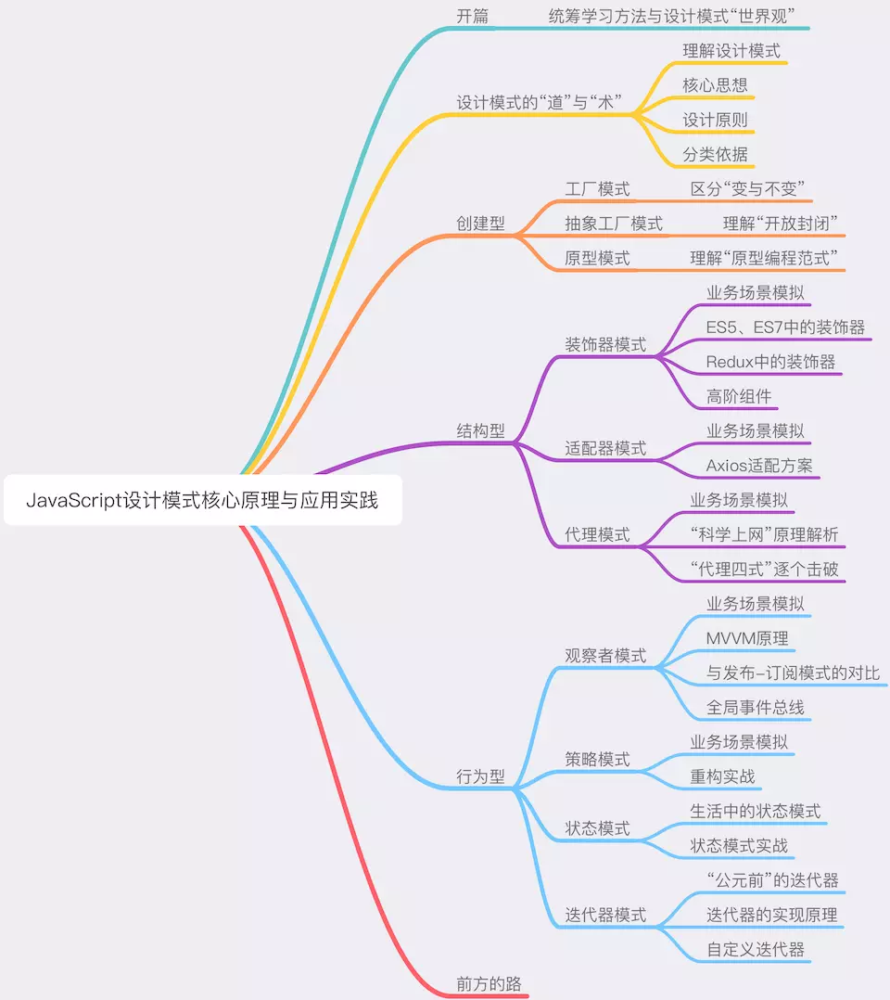

# 所谓成长

* 前端领域距离人才饱和还有很长很长一段路要走
* 找到自己的核心竞争力（***我的特别之处***）

## 驾驭技术的能力

分为以下三个层次：

* 能用健壮的代码去解决具体的问题；
* 能用抽象的思维去应对复杂的系统；
* 能用工程化的思想去规划更大规模的业务。

> 基础理论知识是一个人的基线，理论越强基线越高。再为自己定一个目标和向上攀附的阶梯，那么达到目标就是时间问题，而很多野路子工程师搞了半辈子也未达到优秀工程师的基线，很多他们绞尽脑汁得出的高深学问，不过是正规工程师看起来很自然的东西。—— 吴军

## 目标

通过学习这部分设计模式，我们至少可以达到三个目的：

* 充分理解前端设计模式的核心思想和基本理念，在具体的场景中掌握抽象的设计原则
* 会写代码，会写好代码；
* 会面试，能言之有物
