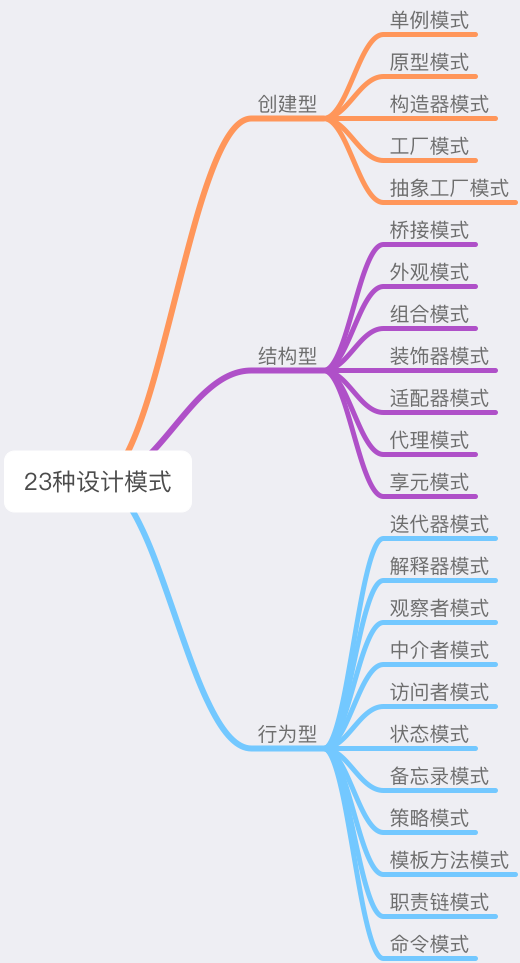

# 设计模式之道

> 每一个模式描述了一个在我们周围不断重复发生的问题，以及该问题的解决方案的核心。这样，你就能一次又一次地使用该方案而不必做重复劳动。 —— Christopher Alexander

## SOLID 设计原则

> "SOLID" 是由罗伯特·C·马丁在 21 世纪早期引入的记忆术首字母缩略字，指代了面向对象编程和面向对象设计的五个基本原则。

设计原则是设计模式的指导理论，它可以帮助我们规避不良的软件设计。SOLID 指代的五个基本原则分别是：

- **单一功能原则**（Single Responsibility Principle）
- **开放封闭原则**（Opened Closed Principle）
- 里式替换原则（Liskov Substitution Principle）
- 接口隔离原则（Interface Segregation Principle）
- 依赖反转原则（Dependency Inversion Principle）

## 设计模式的核心思想——封装变化

将变化造成的影响**最小化** —— **将变与不变分离，确保变化的部分灵活、不变的部分稳定**。
这个过程，就叫“封装变化”；这样的代码，就是我们所谓的“健壮”的代码，它可以经得起变化的考验。而设计模式出现的意义，就是帮我们写出这样的代码。

## 设计模式的“术”

所谓“术”，其实就是指二十年前 [GOF](https://baike.baidu.com/item/GoF) 提出的最经典的 23 种设计模式。二十年前，四位程序员前辈（Erich Gamma, Richard Helm, Ralph Johnson & John Vlissides）通过编写《设计模式：可复用面向对象软件的基础》这本书，阐述了设计模式领域的开创性成果。在这本书中，将 23 种设计模式按照“创建型”、“行为型”和“结构型”进行划分：

设计模式的核心思想，就是“封装变化”。无论是创建型、结构型还是行为型，这些具体的设计模式都是在用自己的方式去封装不同类型的变化 ——

- 创建型模式封装了创建对象过程中的变化，是将创建对象的过程抽离；
- 结构型模式封装的是对象之间组合方式的变化，目的在于灵活地表达对象间的配合与依赖关系；
- 行为型模式则将是对象千变万化的行为进行抽离，确保我们能够更安全、更方便地对行为进行更改。
